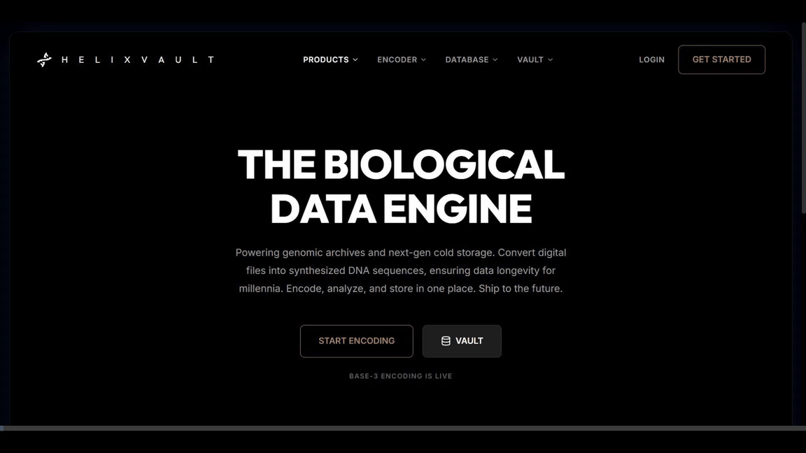
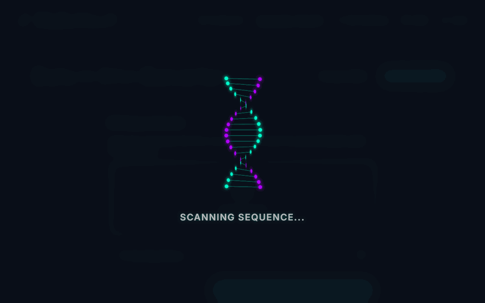
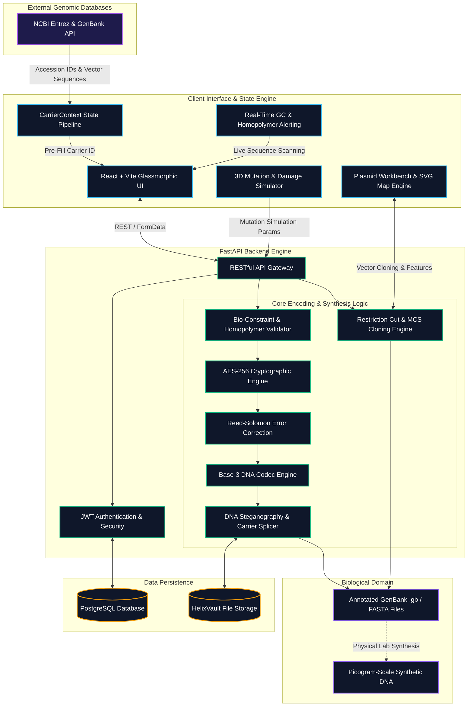

# 🧬 HelixVault: Next-Gen DNA Data Storage

<div align="center">
  
  
  
</div>

<br/>

> HelixVault is a futuristic web application designed to encode digital files (PDFs, Images, Text) into synthesized biological DNA sequences (`.fasta`, `.gb` GenBank formats) for millennia-scale data storage. It features advanced biological simulations, steganography, and robust error correction mathematically proving the viability of DNA storage.

*Developed as a master-level MCA academic project.*

---

## 📸 Application Showcase

### 🏠 Homepage — The Biological Data Engine
<div align="center">
  
  <p><em>A premium dark-themed dashboard with interactive SpotlightCards, real-time GC Content analytics, and a cinematic hero section showcasing DNA vs. traditional storage.</em></p>
</div>

### ⚙️ DNA Encoder Interface
<div align="center">
  
  <p><em>Upload files and transform them into biological DNA sequences using Base-3 encoding, AES-256 encryption, Reed-Solomon ECC, and DNA steganography — all in a sleek glassmorphic interface.</em></p>
</div>

### 🦠 Decoder & Mutation Simulator
<div align="center">
  
  <p><em>Upload GenBank files, deliberately simulate biological DNA damage with the mutation engine, then watch Reed-Solomon error correction perfectly reconstruct the original data.</em></p>
</div>

### 🔐 Secure Vault & Bio Database
<div align="center">
  
  <p><em>Secure Vault for managing encoded DNA files with download/delete actions, and the Biological Database for querying real genomic sequences from NCBI — all behind JWT authentication.</em></p>
</div>


---

## 🏗️ Architecture Diagram

<div align="center">


</div>

---

## ✨ Core Features

*   **🧬 Digital-to-DNA Encoding:** Uses a custom Base-3 encoding algorithm to convert binary data into homopolymer-free biological sequences (A, C, G, T).
*   **🛡️ Reed-Solomon Error Correction:** Mathematically injects redundant DNA bases to protect your data. Even if the DNA degrades physically over thousands of years, the file can be perfectly recovered.
*   **🦠 DNA Steganography:** Hides your encoded data deep inside a massive, naturally occurring "Host" DNA sequence (e.g., the *E. coli* genome) using biological start/stop marker codons.
*   **⚠️ 3D Biological Mutation Simulator:** A cinematic 3D CSS simulator that allows users to intentionally corrupt (mutate) random bases in their `.gb` file to test the Error Correction algorithm in real-time.
*   **🔒 AES-256 Encryption:** Secure your encoded DNA payload with bank-grade encryption before it is synthesized.
*   **✅ SHA-256 Integrity Verification:** Calculates cryptographic hashes to mathematically guarantee the recovered file is a 100% pixel-by-pixel match with the original.
*   **💰 Synthesis Estimator:** Calculates the real-world lab cost to print your sequence ($0.10/bp) and estimates the microscopic physical weight of the DNA in picograms.

---

## 🛠️ Technology Stack

**Frontend:**
*   React (Vite)
*   Recharts (Analytics)
*   Lucide React (Icons)
*   Pure Vanilla CSS (Custom Glassmorphism & 3D Rendering)

**Backend:**
*   Python FastAPI
*   SQLAlchemy (Database ORM)
*   BioPython (Genomic Sequence Manipulation)
*   ReedSolo (Error Correction Coding)

**Deployment:**
*   **Frontend:** Vercel (`helixvault-omega.vercel.app`)
*   **Backend:** Render (`helixvault.onrender.com`)
*   **Database:** PostgreSQL (Hosted on Render)

---

## 🚀 How to Use the Simulator

1.  **Encode Data:** Go to the Encoder, upload a PDF, check **"Use Error Correction"** and **"Extract from Steganography"**, and click Encode. Download your `.gb` file.
2.  **Mutate DNA:** Go to the Decoder, upload the newly created `.gb` file. Click **"Simulate Biological Mutation"** to intentionally damage the DNA sequence. 
3.  **Recover Data:** Click **Extract Data**. The backend will bypass the biological anomalies, slice out the steganography, trigger the Reed-Solomon engine to repair the damaged bases, and return your original file!

---

## 🆕 Recent Updates (v3.0)

*   **Interactive Steganography Carrier Integration:** Built persistent React state management (`CarrierContext`) linking the Biological Database directly to the DNA Encoder. Selecting an NCBI carrier vector automatically expands advanced security options and pre-fills the host carrier sequence accession ID.
*   **Systematic Plasmid Workbench Architecture:** Re-engineered the Synthetic Biology Plasmid Workbench into an ultra-clean, industry-grade 2-column dashboard featuring a unified Cloning Pipeline deck, 3-tier construct workspace, circular SVG hover tooltips, and space-justified specification ledgers.
*   **Dynamic "Data Splicing" Overlay Visualizer:** Added a live visualizer toggle in the biological context view that highlights spliced encrypted payload blocks in bright cyan text with interactive tooltip markers.
*   **Real-Time DNA Metrics & Homopolymer Alerts:** Implemented live statistic chips tracking GC content percentages and actively warning users against homopolymer repeats (>4 consecutive identical bases) that cause synthesis errors.
*   **Dynamic Laboratory Vial Placeholder:** Replaced empty idle state panels with a sleek, semi-transparent animated SVG wireframe of a DNA strand and laboratory vial.
*   **Fixed Menu Clipping & Dropdown Overflow:** Overrode CSS wrapper overflow constraints (`overflow: visible`) across showcase cards and added vertical scrollbars to ensure complete visibility of all NCBI database selections (pUC19, GFP, T7 Promoter, Cas9).
*   **Fixed Reed-Solomon Heuristics:** Stripped out a flawed Heuristic Frame Alignment bug in the decoding engine that misinterpreted substitutions as indels, dramatically improving the accuracy of error correction.
*   **PDF Rendering Fix:** Removed restrictive iframe sandboxing in the React frontend, allowing the browser's native PDF plugin to seamlessly render recovered `.pdf` files.
*   **Dockerization:** The entire application (React, FastAPI, PostgreSQL) is fully containerized via `docker-compose` for instant, isolated, one-click deployments.

---

## 💻 Running Locally

### Option A: Using Docker (Recommended)
You can launch the entire stack (Frontend, Backend, Database) with a single command:
```bash
docker compose up --build -d
```
*   **Frontend:** `http://localhost:80`
*   **Backend API:** `http://localhost:8000`
*   **Database:** PostgreSQL on `localhost:5432`

### Option B: Manual Setup (No Docker)

#### 1. Start the Backend
```bash
cd backend
python -m venv venv
.\venv\Scripts\activate
pip install -r requirements.txt
uvicorn main:app --reload --port 8000
```

#### 2. Start the Frontend
```bash
cd frontend
npm install
npm run dev
```

---

## 📜 License
This project is open-source and available under the MIT License.
